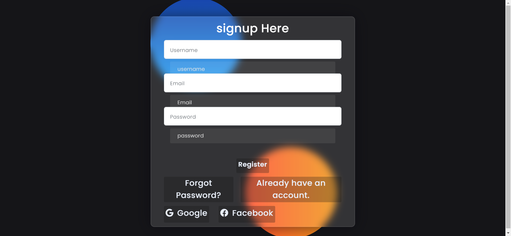
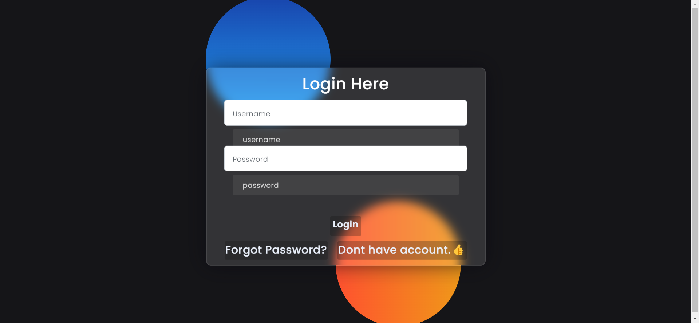
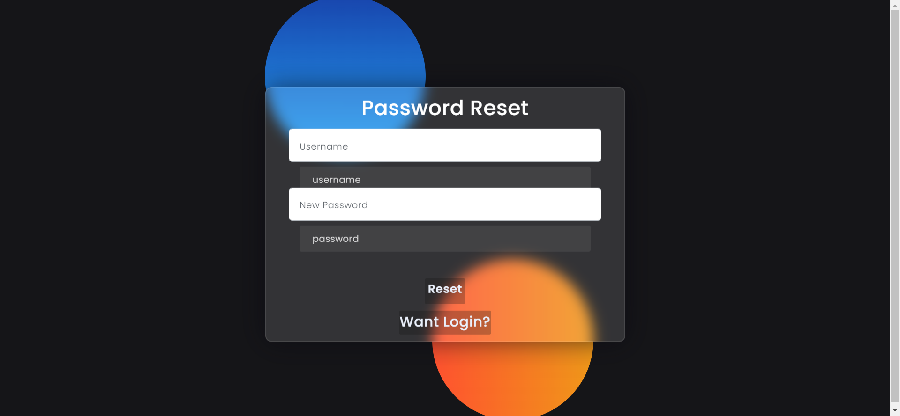
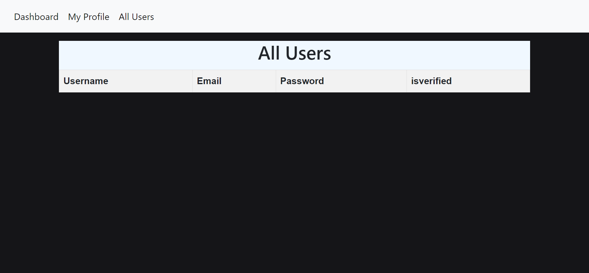

# Running the Frontend App Locally

To run the React App locally, follow these steps:

1. **Install NodeJS and NPM:**
   Make sure you have NodeJS and NPM installed on your machine. If not, you can download and install them from [https://nodejs.org](https://nodejs.org).

2. **Download or Clone the Project:**
   Download or clone the project source code from the GitHub repository:
   [Backend](https://github.com/asjad895/Reacts_Authentication-System/tree/main)
   Download Frontend code from this repo
   [frontend app](https://github.com/asjad895/app) and copy all ```app/``` dir code in this repo code ```Frontend/app``` dir
   Go to Frontend/app dir
3. **Install NPM Packages:**
   Open the command line in the project root folder (where the `package.json` is located) and run the following command to install all required npm packages:
```npm install```

4. **Start the App:**

```npm start```

# Backend  

1. Create python env ```python -m venv myvenv```
2. activate env ```myvenv\Scripts\activate.bat```
3. Go to Backend dir run ```pip install -r requirements.txt```
4. run server ```python app.py```

# Intract With Frontend UI








